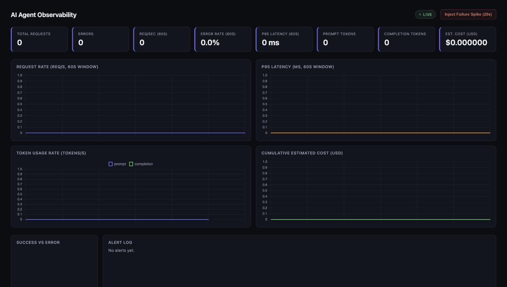
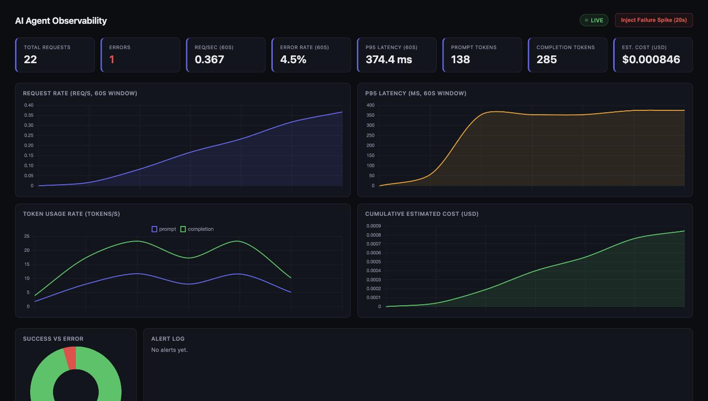

# AI Agent Observability Stack

[](https://github.com/pranavsivaprasad230501/ai-agent-observability/actions/workflows/ci.yml)

A DevOps project built around a real AI-native problem: **how do you know an
AI agent is degrading, timing out, or burning through budget before a
customer notices?** A mock LLM agent service is instrumented end-to-end —
Prometheus metrics, a live animated dashboard, threshold-based alerting, and
a one-click chaos-injection demo — all orchestrated with Docker Compose and
runnable on localhost with a single command.



*Live capture: traffic ramping up on the charts, clicking "Inject Failure
Spike," the error-rate and latency alerts firing in real time, and both
resolving on their own once the system recovers.*



## Why this project

Agentic AI companies (Lyzr AI included) live and die by whether their agents
are *reliable, fast, and cost-effective in production*. That means the same
observability discipline used for any backend service — latency, error
rate, throughput — plus AI-specific signals: token usage and estimated
cost per call, and the operational muscle to detect and recover from
degradation automatically. This project demonstrates that end-to-end:

- **Instrumented service** (`agent-api/`) — a FastAPI app exposing an
  `/agent/chat` endpoint that simulates an LLM agent call, with a pluggable
  backend (mock / OpenAI / Lyzr).
- **Metrics collection** (`prometheus/`) — Prometheus scrapes custom
  metrics: request rate, latency histogram, error rate, token usage, and
  cumulative cost.
- **Live dashboard with real charts** (`/dashboard`) — animated Chart.js
  time series for request rate, p95 latency, token throughput, and
  cumulative cost, plus a success/error breakdown — all served directly by
  the agent API, refreshing every 3 seconds.
- **Threshold-based alerting** — the API evaluates error-rate and latency
  thresholds after every request. Breaches fire an alert (shown as a live
  banner + logged with a timestamp); recovery auto-resolves it. This is the
  same fire/resolve model production alerting tools use, implemented from
  scratch rather than bolted on.
- **Chaos injection** — a button on the dashboard (`POST /chaos/inject`)
  triggers a 20-second window of elevated latency and failures, so you can
  demonstrate — live, in an interview — an alert firing, the charts
  spiking, and the system recovering on its own once the window ends.
- **On-demand synthetic load** (`load-generator/`) — a short-lived
  container you run manually to populate the dashboard, which exits on its
  own after ~60 seconds rather than running continuously.

## Why it's lean

An earlier version of this also ran Grafana as a third container and kept
the load generator running 24/7. Grafana alone was ~330MB of RAM for
something the agent API can render itself in a few KB of HTML/JS, and the
load generator had no reason to run when you're not actively demoing it.
Current default footprint:

| Container | RAM | Always running? |
|---|---|---|
| `agent-api` | ~40MB | Yes |
| `prometheus` | ~35MB | Yes |
| `load-generator` | ~15MB | No — on-demand, self-exits after 60s |

## Architecture

```
(on demand) load-generator ──▶ agent-api (FastAPI) ──┬─▶ /metrics ────────▶ Prometheus
                                     │                ├─▶ /dashboard (live Chart.js view)
                                     │                └─▶ alert engine (fire/resolve, in-process)
                                     └─ mock / OpenAI / Lyzr backend (pluggable)
                                     ▲
                          POST /chaos/inject (manual trigger)
```

## Quickstart

Requires Docker Desktop (already running).

```bash
cd ai-agent-observability
docker compose up --build -d
```

This starts only `agent-api` and `prometheus` — nothing else runs unless
you ask for it. Then open:

- **Live dashboard** → http://localhost:8000/dashboard — charts, alerts,
  and the chaos-injection button, all built into the agent API.
- **Agent API docs (Swagger)** → http://localhost:8000/docs — try
  `/agent/chat` directly.
- **Prometheus** → http://localhost:9090 — raw PromQL queries, e.g.
  `histogram_quantile(0.95, rate(agent_request_latency_seconds_bucket[5m]))`.

To generate traffic so the dashboard has data to show:

```bash
make load
```

This runs a short-lived container that sends requests for ~60 seconds and
then exits and removes itself automatically. Re-run `make load` any time
you want another burst.

To demo alerting + auto-recovery live: open `/dashboard`, click
**"Inject Failure Spike (20s)"** while traffic is flowing (`make load` in
another terminal), and watch the latency chart spike, the alert banner
fire, and the alert log resolve itself once the window passes.

To stop everything: `docker compose down`. Makefile shortcuts: `make up`,
`make down`, `make logs`, `make load`, `make restart`.

## What's being measured

| Metric | Type | What it tells you |
|---|---|---|
| `agent_requests_total{status}` | Counter | Request volume, success vs. error split |
| `agent_request_latency_seconds` | Histogram | p50/p95/p99 latency of agent calls |
| `agent_errors_total{error_type}` | Counter | Which failure modes are occurring |
| `agent_tokens_total{type}` | Counter | Prompt vs. completion token volume |
| `agent_cost_usd_total` | Counter | Running estimated spend |

The mock backend deliberately injects ~8% simulated timeouts and variable
latency during normal operation (bumped to ~70%/1-2.5s during a chaos
window) so the error-rate, latency, and alerting panels have something
real to react to.

## Alerting rules

Evaluated in-process after every request (`_evaluate_alerts` in
`agent-api/app.py`):

| Rule | Threshold | 
|---|---|
| High error rate | error rate > 20% over the trailing 60s |
| High latency | p95 latency > 500ms over the trailing 60s |

Each rule tracks its own fire/resolve state, so the alert log reads like a
real incident timeline rather than a flat list of breaches.

## Swapping in a real agent backend

By default `MOCK_MODE=true`, so no external calls are made. To use a real
backend, copy `.env.example` to `.env` and set:

- `OPENAI_API_KEY` — routes `/agent/chat` through OpenAI (`gpt-4o-mini`)
  and reports real token usage from the API response.
- `LYZR_API_KEY` — a placeholder is wired in at `_openai_agent_call` /
  `call_agent` in `agent-api/app.py`; swap in a call to Lyzr's Agent API
  there to observe a real Lyzr agent through this same stack.

Then: `docker compose up --build -d`.

## CI

`.github/workflows/ci.yml` builds the images, starts the stack, and runs
smoke tests against `/health`, `/agent/chat`, `/metrics`, `/dashboard`, and
the Prometheus target health on every push to `main` and every PR.

## Extension ideas (good talking points)

- Route alerts to Slack/PagerDuty via a webhook instead of just the UI.
- Add **structured JSON logging** for log correlation alongside metrics.
- Add **OpenTelemetry tracing** to see the full request path through a
  multi-step agent (tool calls, retries, sub-agents).
- Simulate multiple named agents (support, sales, data-analyst, ...) with
  independent traffic/error profiles and a fleet-overview dashboard.
- Re-introduce Grafana as an optional profile if you want richer,
  PromQL-native dashboards on a machine with more headroom.

## Project layout

```
ai-agent-observability/
├── agent-api/              FastAPI service, Prometheus instrumentation,
│                            built-in /dashboard, alert engine, chaos endpoint
├── prometheus/              Prometheus scrape config
├── load-generator/          On-demand synthetic traffic generator (profile: load)
├── .github/workflows/ci.yml Build + smoke-test pipeline
├── docker-compose.yml
├── Makefile
└── .env.example
```
